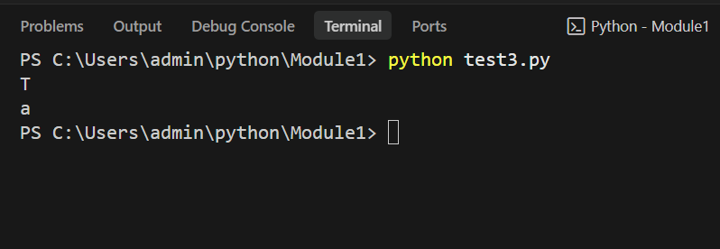

# Datatypes-Character Literal in Python

## 🎯 Aim
To write a Python program that prints the characters `'T'` and `'a'` using character literals.

## 🧠 Algorithm
1. Print the character `'T'`.
2. Print the character `'a'`.

## 🧾 Program
```python
print('T')
print('a')
```

## Output



## Result
Thus, the Python program was successfully executed and the expected output was verified.
