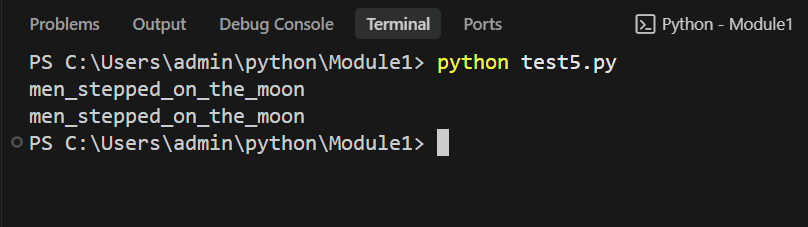

# Datatypes-Read and Print a String in Python

## 🎯 Aim
To write a Python program to read a string from the user and then print it.

## 🧠 Algorithm
1. Assign a variable named `men_stepped_on_the_moon`.
2. Use `input()` to read a string from the user and store it in the variable.
3. Print the value stored in the variable.

## 🧾 Program
```python
men_stepped_on_the_moon = input()
print(men_stepped_on_the_moon)
```

## Output



## Result
Thus, the Python program was successfully executed and the expected output was verified.
